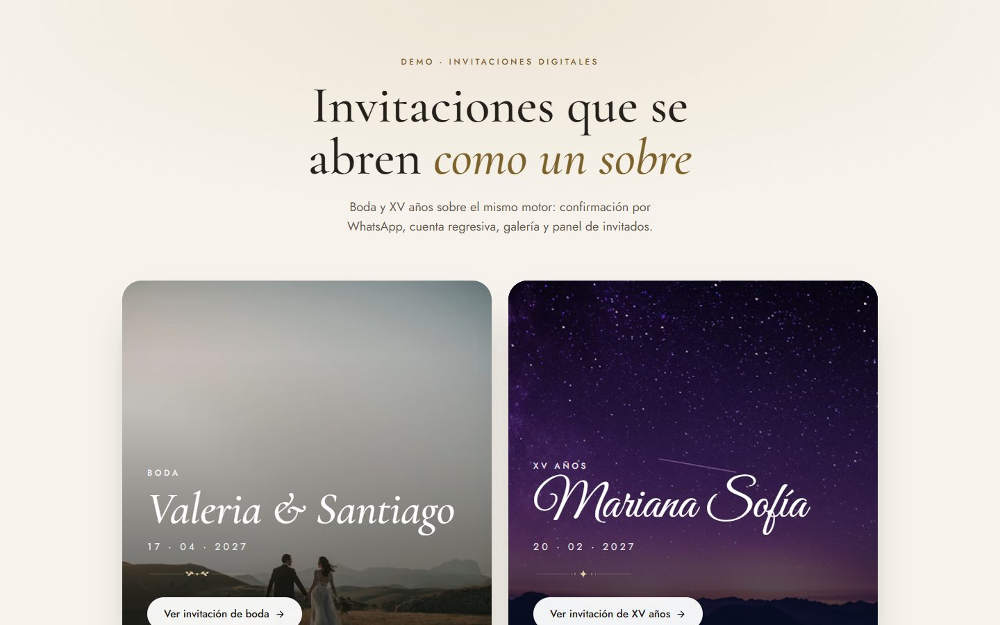
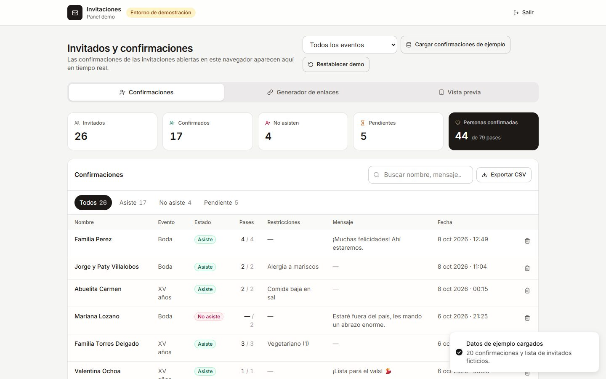
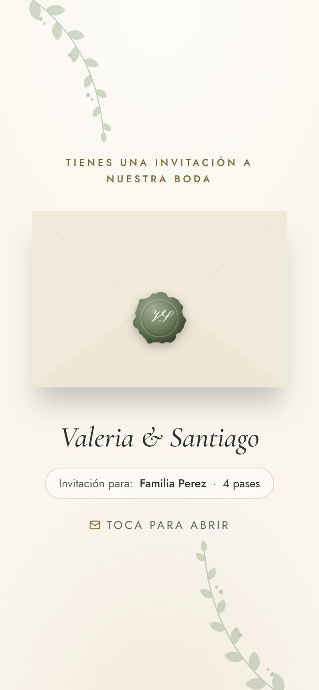
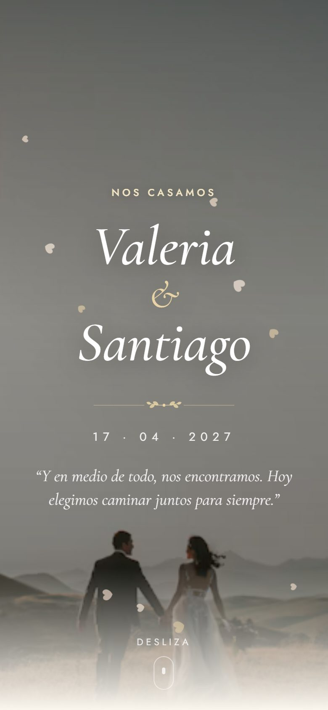
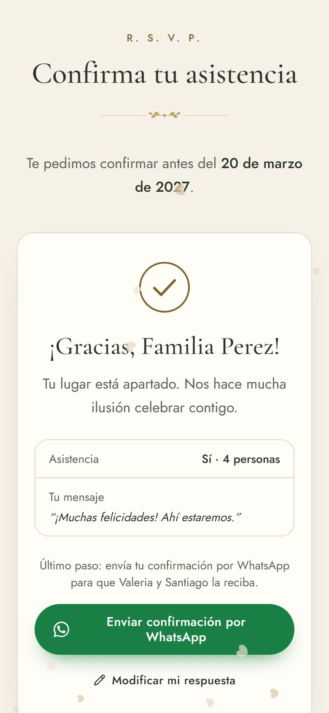
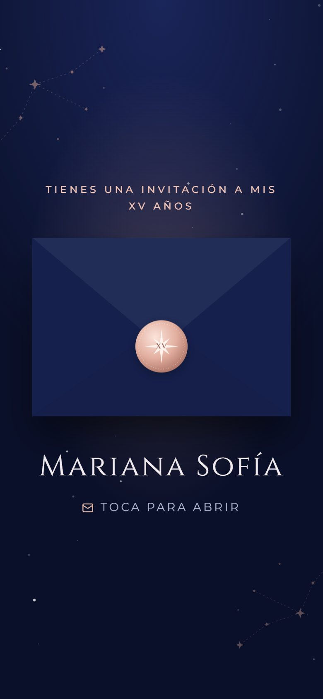
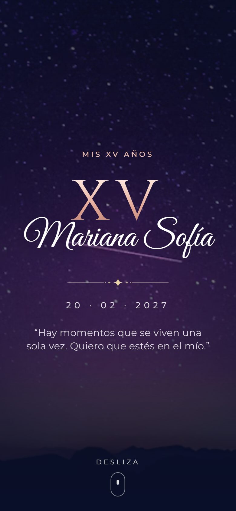
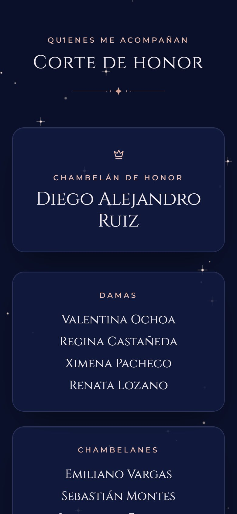

# Invitación digital · Boda y XV años

Demo de **invitaciones digitales animadas** para bodas y XV años, construida sobre un solo motor: cada evento es un archivo de configuración. Incluye portada tipo sobre, cuenta regresiva, galería con lightbox, confirmación de asistencia (RSVP) con envío por WhatsApp, enlaces personalizados por invitado y un panel para generar invitaciones y ver confirmaciones.

Pieza de portafolio de **JacoboDev** · [jacobodev.pages.dev](https://jacobodev.pages.dev)

**Demo en vivo:** [invitacion-digital-at0.pages.dev](https://invitacion-digital-at0.pages.dev) · [Boda](https://invitacion-digital-at0.pages.dev/boda) · [XV años](https://invitacion-digital-at0.pages.dev/xv) · [Invitación personalizada](https://invitacion-digital-at0.pages.dev/boda?invitado=Familia%20Perez&pases=4) · [Panel](https://invitacion-digital-at0.pages.dev/admin)

| Selector de demos | Panel de confirmaciones |
| --- | --- |
|  |  |

| Sobre (boda) | Hero (boda) | RSVP | Sobre (XV) | Hero (XV) | Corte de honor |
| --- | --- | --- | --- | --- | --- |
|  |  |  |  |  |  |

## Rutas

| Ruta | Qué es |
| --- | --- |
| `/` | Selector de demos (la página que se enlaza desde el portafolio) |
| `/boda` | Invitación de boda — Valeria & Santiago |
| `/xv` | Invitación de XV años — Mariana Sofía |
| `/boda?invitado=Familia%20Perez&pases=4` | Invitación personalizada: nombre en la portada y RSVP limitado a 4 pases |
| `/admin` | Panel demo (usuario `demo`, contraseña `demo123`) |

## Qué incluye

**Invitación** (mobile-first, probada a 375, 768 y 1440 px)

- Portada tipo **sobre** que se abre con un toque (solapa que gira, carta que sube) y arranca la música. Sello de cera para la boda, broche de oro rosado con fondo estrellado para XV.
- Hero con nombres animados, fecha, frase y parallax sutil.
- **Cuenta regresiva** en vivo con dígitos animados; si la fecha ya pasó muestra "¡Gracias por acompañarnos!".
- Historia en línea del tiempo (boda) o tarjeta "Sobre mí" (XV).
- Tarjetas de ceremonia y recepción con **Cómo llegar** (Google Maps / Waze) y **Agregar al calendario** (Google Calendar, Outlook o descarga `.ics`).
- Itinerario, corte de honor / padrinos, galería masonry con **lightbox accesible** (swipe, flechas, Escape, foco atrapado), código de vestimenta con muestras de color y colores reservados, mesa de regalos y transferencia con botón **Copiar**.
- **RSVP funcional** con validación en vivo (zod), límite de pases, restricciones alimenticias, mensaje, pantalla de agradecimiento con confeti y botón **Enviar confirmación por WhatsApp** con mensaje formateado. Si el invitado ya confirmó en ese navegador, ve su respuesta y puede modificarla.
- Reproductor de música flotante con ecualizador; se oculta solo si no hay archivo de audio.
- Efectos ligeros: pétalos (CSS) en la boda, destellos (canvas) en XV, confeti al confirmar. Se pausan con la pestaña oculta y se desactivan con `prefers-reduced-motion`.

**Panel `/admin`**

- Login falso con aviso de entorno de demostración.
- **Confirmaciones**: KPIs (invitados, confirmados, no asisten, pendientes, personas confirmadas), filtros por estado y evento, búsqueda, recordatorio por WhatsApp a pendientes y exportación a CSV.
- **Generador de enlaces**: individual (copiar, enviar por WhatsApp, abrir) y **carga masiva** pegando texto o subiendo un CSV (`Nombre, pases`; también acepta columnas copiadas de Excel/Sheets). Exporta la lista de enlaces a CSV.
- **Vista previa** de ambas invitaciones en marco de teléfono.
- **Cargar confirmaciones de ejemplo** (20 respuestas ficticias + pendientes) y **Restablecer demo**.
- Sincronización entre pestañas: si alguien confirma en la invitación, la respuesta aparece en el panel abierto en otra pestaña con un aviso.

## Stack

- **Nuxt 4** (`ssr: false`, generado estático) + **Vue 3** `<script setup lang="ts">` + TypeScript estricto
- **Tailwind CSS 4** con tokens de diseño en variables CSS (uno por tema de evento)
- **@nuxt/fonts** (Google Fonts, `font-display: swap`) y **@nuxt/icon** (Lucide, empaquetados en el cliente)
- **@vueuse/core**, **@vueuse/motion**
- **Pinia** + `pinia-plugin-persistedstate` (localStorage)
- **date-fns** (locale `es`), **zod**, **vue-sonner** (toasts)
- **Vitest** para la lógica pura

## Cómo correrlo

Requiere Node 22 (ver `.node-version`). En PowerShell:

```powershell
npm install
npm run dev          # http://localhost:3000
npm test             # pruebas de utilidades (Vitest)
npm run lint
npm run typecheck
npm run generate     # sitio estático en .output/public
npm run preview      # sirve .output/public con `serve`
```

Credenciales del panel: **`demo` / `demo123`**.

## Despliegue en Cloudflare Pages

1. Conecta el repositorio en Cloudflare Pages.
2. **Build command:** `npm run generate`
3. **Build output directory:** `.output/public`
4. (Opcional) Variable de entorno `NUXT_PUBLIC_SITE_URL` con la URL final (se usa en `og:url`). Por defecto: `https://invitacion-digital-at0.pages.dev`.

Cada ruta tiene su propio HTML (`index.html`, `boda.html`, `xv.html`, `admin.html`, `admin/login.html`), así que recargar cualquier ruta funciona con o sin parámetros de consulta. `public/_redirects` incluye `/* /index.html 200` como respaldo para rutas no generadas. En el despliegue actual Cloudflare no aplica esa regla (una ruta inexistente responde 404), pero no hace falta: las rutas reales existen como archivos y `404.html` es la misma app, que muestra la página de "invitación no encontrada".

## Crear una invitación nueva para un cliente

El motor no se toca: todo sale de un archivo de configuración.

1. Copia `app/events/boda-demo.ts` (o `xv-demo.ts`) a, por ejemplo, `app/events/boda-ana-luis.ts`.
2. Cambia el `slug` (será la ruta: `/boda-ana-luis`) y el nombre de la constante exportada.
3. Regístralo en `app/events/index.ts`:
   ```ts
   import { bodaAnaLuis } from './boda-ana-luis'
   export const events: InvitationConfig[] = [bodaDemo, xvDemo, bodaAnaLuis]
   ```
4. Listo: la ruta, sus fuentes, sus metas para WhatsApp/Facebook, su portada estática y su entrada en el panel se generan solos.

Campos principales de `InvitationConfig` (`app/events/types.ts`):

| Campo | Para qué |
| --- | --- |
| `tipo` | `'boda'` o `'xv'`: cambia textos fijos y algunas secciones |
| `tema` | Colores (`colores`), tipografías y pesos (`tipografia`), `ornamentos` (`botanico` / `estelar`), `sobre` (`sello-cera` / `nocturno`), `efecto` (`petalos` / `destellos` / `ninguno`) |
| `titulo`, `novios` / `festejada`, `anfitriones`, `frase`, `fotoPrincipal` | Portada, hero y bienvenida |
| `fecha` | ISO con desfase, p. ej. `2027-04-17T17:00:00-06:00` (México usa -06:00 todo el año) |
| `ceremonia`, `recepcion` | Lugar, dirección, hora, duración, coordenadas y enlace de Maps |
| `itinerario`, `historia` / `sobreMi`, `galeria`, `padrinos`, `corte`, `vestimenta`, `regalos` | Secciones opcionales: **si un campo no existe, su sección no aparece** |
| `rsvp` | Fecha límite, **WhatsApp del anfitrión** (`52` + 10 dígitos), nombre de contacto, pases por defecto y máximo |
| `musica` | Ruta del audio en `public/` y título |
| `hashtag`, `redes`, `cierre` | Pie de la invitación |
| `seo` | Título, descripción e imagen Open Graph (1200×630) para la vista previa al compartir |

**Fotos:** cualquier URL funciona. Las de Unsplash reciben `srcset` y formato moderno automáticamente; para fotos del cliente, colócalas en `public/fotos/` y usa `src: '/fotos/portada.jpg'`. Si una imagen falla se muestra un placeholder elegante.

**Música:** coloca el archivo en `public/audio/` (p. ej. `public/audio/boda.mp3`) y apunta `musica.src` a `/audio/boda.mp3`. Este repositorio **no incluye música** para no distribuir pistas con derechos de autor; mientras no exista el archivo, el botón de música simplemente no aparece. Fuentes de música libre de derechos: [Pixabay Music](https://pixabay.com/music/), [Free Music Archive](https://freemusicarchive.org/) (revisa la licencia de cada pista) y la [Biblioteca de audio de YouTube](https://www.youtube.com/audiolibrary).

## Limitaciones conocidas

- **RSVP local:** no hay backend. Las confirmaciones se guardan en `localStorage` del navegador donde se responden y el anfitrión las recibe por **WhatsApp**. El panel solo ve las respuestas hechas en ese mismo navegador (por eso existe "Cargar confirmaciones de ejemplo"). Para producción real se conectaría a un backend (Cloudflare D1/Workers, Supabase, Google Sheets…).
- **Vista previa social no personalizable por invitado:** en un sitio estático la tarjeta de WhatsApp/Facebook es la misma para todos los enlaces de un evento (los crawlers no ejecutan JavaScript ni leen `?invitado=`). Sí es distinta por evento: `boda.html` y `xv.html` se generan con sus propias metas.
- **Login del panel** es de demostración (credenciales visibles, sin seguridad real).
- **Nombres con coma en CSV** deben ir entre comillas (`"Pérez, Familia",4`) o usar `;` / tabulador como separador.
- La sincronización en vivo del panel funciona entre pestañas del mismo navegador (evento `storage`), no entre dispositivos.

## Rendimiento y accesibilidad

Lighthouse móvil sobre el build estático servido en local (`serve`):

| Página | Rendimiento | Accesibilidad | Buenas prácticas | SEO |
| --- | --- | --- | --- | --- |
| `/boda?invitado=…` | 87–88 | 100 | 100 | 100 |
| `/xv` | 87 | 100 | 100 | 100 |
| `/` | 87–88 | 100 | 100 | 100 |

Medido en local, Lighthouse da 87–88 de rendimiento, todavía abajo de la meta de 90. En modo simulado (Lantern) la cifra sale pesimista: como en `localhost` todo el JS termina de descargarse antes del primer pintado, lo cuenta como dependencia del LCP. Con throttling real (`--throttling-method=devtools`) el LCP de `/boda` es de unos 2 s. Para el número definitivo conviene correr PageSpeed Insights sobre la URL desplegada. Primera carga: ~330 KB.

Decisiones para lograrlo:

- **Portada estática por evento:** el HTML generado de `/boda` y `/xv` trae una réplica en HTML/CSS del sobre cerrado (`app/utils/cover.ts`), así el primer pintado ya es la invitación y no un loader; la app la reemplaza sin parpadeo al montar.
- Las secciones bajo el pliegue son componentes `Lazy` que se montan al tocar el sobre (la animación de apertura corre en el compositor mientras tanto). zod solo se descarga con el RSVP.
- `preload` de las fuentes críticas de cada página y de la imagen LCP del selector; solo los pesos usados por cada tema.
- Animaciones solo con `transform`/`opacity`; `box-shadow` en lugar de `filter: drop-shadow`; skeleton con `transform`; efectos pausados con la pestaña oculta.
- Accesibilidad: navegación por teclado, foco visible, `alt` descriptivo, áreas táctiles ≥ 44 px, roles ARIA en lightbox (dialog), tabs del panel y reproductor; contraste AA en texto de cuerpo; `prefers-reduced-motion` desactiva sobre animado, parallax, partículas y confeti.

## Decisiones técnicas

- **Una sola página dinámica (`pages/[slug].vue`)** en lugar de `boda.vue` y `xv.vue`: así un tercer evento no requiere tocar componentes ni rutas, solo agregar su archivo y registrarlo.
- **Tokens por tema como variables CSS** (`--c-*`, `--f-*`) inyectadas desde la config y mapeadas a utilidades de Tailwind (`bg-bg`, `text-ink`, `font-display`…). Un mismo componente se ve "boda" o "XV" según el tema.
- **Fuentes desde la config:** `nuxt.config.ts` lee los temas para declarar las familias en `@nuxt/fonts` y genera una hoja que las menciona (el módulo solo crea `@font-face` para familias que aparecen literalmente en el CSS).
- **Metas sociales por evento** inyectadas al generar (`prerender:generate`), porque con `ssr: false` `useSeoMeta` solo corre en el navegador y los crawlers no lo ven.
- **Hora del evento "de pared":** las fechas se guardan como ISO con desfase de CDMX y se muestran con la hora local del evento aunque el invitado esté en otra zona horaria. El `.ics` usa horas UTC (`Z`), que Google Calendar, Apple Calendar y Outlook interpretan igual sin depender de `VTIMEZONE`.
- **GSAP no se usó:** las animaciones de scroll se resolvieron con `IntersectionObserver` (`v-reveal`) y CSS, más ligero que cargar GSAP + ScrollTrigger. `@vueuse/motion` se usa en la entrada del agradecimiento del RSVP; la entrada del hero usa keyframes CSS porque en celulares de gama media se ve más fluida que la interpolación por JS.
- **Lógica pura en `app/utils/`** con pruebas en `tests/`: `.ics` y enlaces de calendario, mensajes y enlaces de WhatsApp, parseo y armado de enlaces de invitado, cuenta regresiva, parser de listas/CSV y exportación con protección contra fórmulas de Excel, validación del RSVP, inyección de metas.
- **Restablecer demo** borra confirmaciones, lista de invitados y preferencias de música de este navegador; conserva la sesión del panel para no interrumpir una presentación.
- Todos los nombres, lugares, teléfonos y datos bancarios son **ficticios**. Las fotos son de Unsplash (detalles, lugares y siluetas, sin rostros identificables con nombre).

## Estructura

```
app/
  assets/css/main.css        # tokens, base, botones, campos, animaciones
  components/
    invitation/              # Envelope, Hero, Intro, Countdown, Story, AboutMe, EventCards,
                             # CalendarMenu, Itinerary, Court, Gallery, Lightbox, DressCode,
                             # Registry, Rsvp, MusicPlayer, Footer, Section
    effects/                 # Confetti, Sparkles, Petals
    ornaments/               # Divider, Branch, Constellation, Seal (SVG propios)
    admin/                   # Kpis, Responses, Generator, Preview
    ui/                      # SmartImage, WhatsappIcon
  composables/               # useInvitation, useCountdown, useGuestParams, useMusic, useCalendar, …
  events/                    # types.ts, boda-demo.ts, xv-demo.ts, index.ts (registro)
  layouts/admin.vue
  middleware/admin.ts
  pages/                     # index.vue, [slug].vue, admin/index.vue, admin/login.vue
  plugins/                   # reveal (v-reveal), sync.client (evento storage)
  stores/                    # rsvp, guests, auth
  utils/                     # ics, whatsapp, guest, csv, countdown, dates, rsvp, cover, …
public/
  _redirects
  audio/                     # aquí va la música (no incluida)
tests/                       # Vitest
docs/capturas/
```
